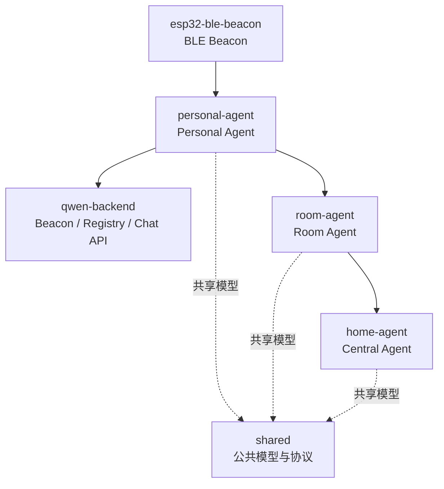

# 系统架构

本文档描述智能家居多 Agent 系统的目标架构、模块边界、状态权威与能力分工。架构主线为 `空间感知 + 服务发现 + A2A 协作`。

## 1. 总体架构

### 三层职责

| 层 | 组件 | 作用 |
|---|---|---|
| 空间感知层 | `esp32-ble-beacon` | 广播空间标识，支持近场房间识别 |
| 服务发现层 | `qwen-backend` | 提供 Beacon API、Registry API 与部分后端服务 |
| 协作执行层 | `personal-agent`、`room-agent`、`home-agent` | 通过 A2A 完成控制、能力查询、仲裁与全局协作 |

## 2. 模块边界

| 模块 | 主要职责 | 明确不负责 |
|---|---|---|
| `personal-agent` | 用户意图入口、个人上下文、Beacon 扫描、目标 Agent 选择 | 不直接维护房间状态，不直接控制设备 |
| `room-agent` | 房间级决策、设备控制闭环、房间状态收敛、能力暴露 | 不承担跨房间全局仲裁，不替代用户意图理解 |
| `home-agent` | 全局状态、家庭策略、跨房间冲突仲裁 | 不直接执行房间设备动作 |
| `qwen-backend` | Beacon/Registry/Chat 服务、Agent 注册发现入口 | 不直接承担 Agent 业务决策 |
| `shared` | 公共模型、协议类型、共享运行时抽象 | 不承载业务流程编排 |
| `esp32-ble-beacon` | 空间广播固件 | 不参与业务协议或 Agent 决策 |

## 3. Agent 职责与状态权威

### Personal Agent

- 唯一负责表达用户意图与个人上下文。
- 维护本地 UI 状态、会话历史、用户偏好、当前空间绑定。
- 把自然语言或快捷操作转换为结构化请求并发往上游 Agent。

### Room Agent

- 是 `Room State` 的唯一权威源。
- 负责房间内设备状态、局部规则与执行闭环。
- 向外暴露房间能力和执行结果，不暴露内部编排细节。

### Central Agent

- 是 `Global State`、策略与仲裁结果的唯一权威源。
- 负责全局模式、风险状态、跨用户与跨房间冲突处理。
- 返回决策，不取代 Room Agent 的本地执行职责。

### 状态维护原则

| 状态 | 权威组件 |
|---|---|
| 用户意图、个人上下文 | Personal Agent |
| 房间状态、房间执行结果 | Room Agent |
| 家庭模式、全局策略、仲裁结果 | Central Agent |

## 4. 模块协作关系

### 正常控制链路

1. `personal-agent` 通过 Beacon 判断当前房间。
2. `qwen-backend` 返回目标 Room Agent 的 AgentCard 与 A2A 入口。
3. `personal-agent` 向 `room-agent` 发起控制请求。
4. `room-agent` 做局部决策、执行设备控制并更新 `Room State`。
5. `room-agent` 返回任务结果或能力描述。

### 需要全局介入的链路

1. `room-agent` 判断请求与全局模式或其他用户意图冲突。
2. `room-agent` 向 `home-agent` 请求仲裁。
3. `home-agent` 返回决策。
4. `room-agent` 按决策执行并回传结果。

## 5. 代码组织约束

### `personal-agent`

- 页面层只负责 UI、录音、展示与调用服务。
- 服务层负责扫描、发现、意图理解、transport 选择与请求发送。
- A2A/MQTT 等通信后端应通过 transport 抽象隔离。

### `room-agent`

- 以 LangGraph 运行时、工具层与集成层分层组织。
- 外部协议入口、MCP、设备控制都应收敛到 `integrations/` 与 `tools/`。
- 业务状态与规则定义应独立于传输层。

### `home-agent`

- 保持中央协调角色，不把房间执行逻辑混入全局策略层。
- 对外输出全局状态与仲裁结果，对内可组合 RAG、策略引擎与中央协调逻辑。

### `shared`

- 只放可复用的类型与运行时公共抽象。
- 不在 `shared` 中放特定 Agent 的业务流程或 UI 逻辑。

## 6. 当前实现注记

- 目标架构以 A2A 为主线，但仓库中仍存在 MQTT 兼容实现。
- `personal-agent` 当前只在部分控制链路切换到了 A2A transport。
- `room-agent` 正在向 LangGraph + A2A 入口重构。
- 这些过渡事实用于解释当前代码分布，不改变本页的目标架构定义。
