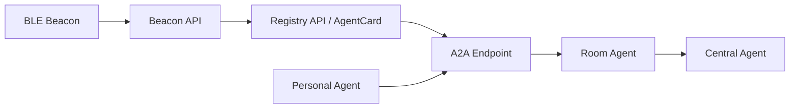
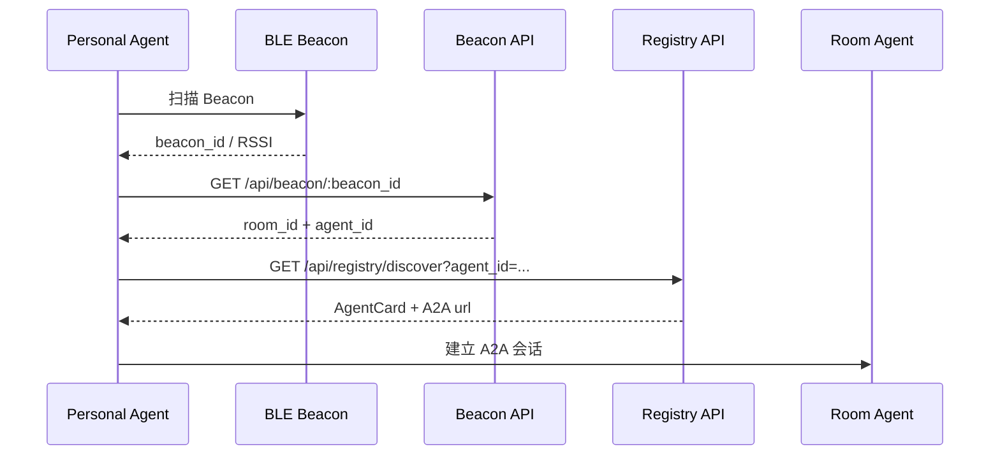
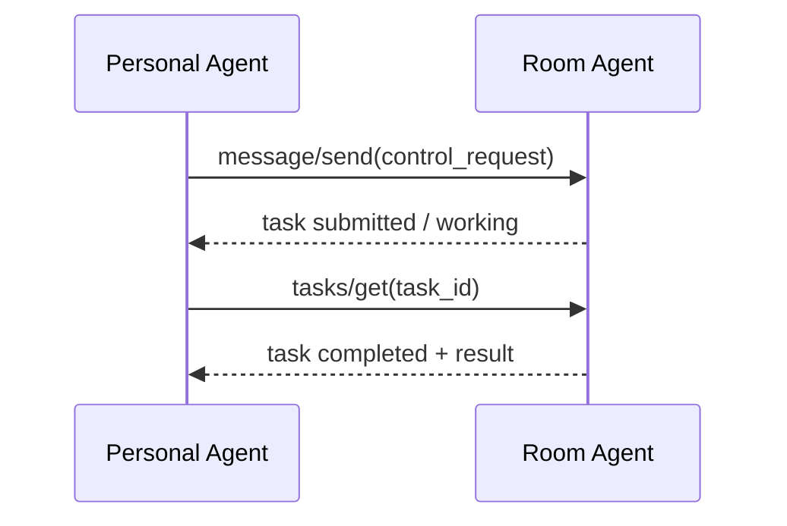
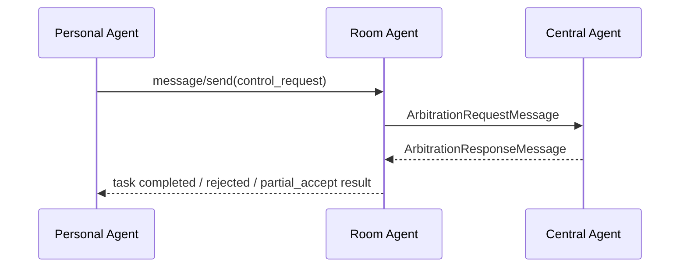
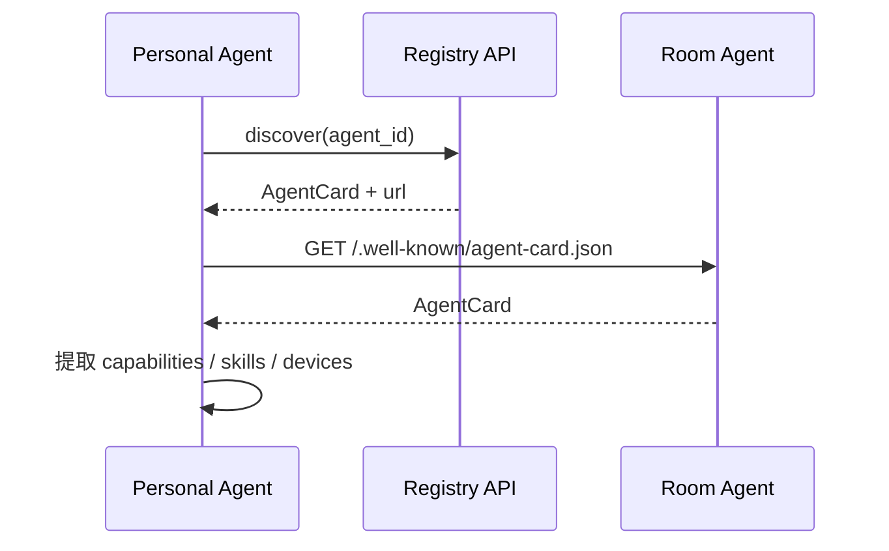

# 传输与协议

本文档定义智能家居多 Agent 系统的目标通信模型。规范主线为 `BLE Beacon -> Beacon API -> Registry API -> A2A`。仓库中仍存在 MQTT 兼容路径，但不作为本页的规范主体。

## 1. 通信栈



### 分层职责

| 层 | 组件 | 职责 |
|---|---|---|
| 空间感知层 | BLE Beacon | 把用户所在物理空间映射为 `beacon_id` |
| 发现层 | Beacon API、Registry API | 把空间标识解析为 `room_id`、`agent_id`、`AgentCard` 和 A2A 入口 |
| 协议层 | A2A | 承载控制请求、能力描述、仲裁、任务结果 |

## 2. 发现链路

### Beacon API

| 接口 | 作用 |
|---|---|
| `POST /api/beacon/register` | 注册 Beacon 与房间映射 |
| `GET /api/beacon/:beacon_id` | 根据 Beacon 查询房间与目标 Agent |
| `GET /api/beacon/room/:room_id` | 根据房间查询已绑定 Beacon / Agent |
| `POST /api/beacon/:beacon_id/heartbeat` | 更新 Beacon 心跳 |

### Registry API

| 接口 | 作用 |
|---|---|
| `POST /api/registry/register` | 注册 AgentCard |
| `GET /api/registry/discover` | 按 `agent_id`、`agent_type`、`capability` 发现 Agent |
| `GET /api/registry/:agent_id` | 获取单个 Agent 注册信息 |
| `POST /api/registry/:agent_id/heartbeat` | 更新 Agent 心跳 |

### 推荐发现顺序

1. Personal Agent 扫描到 `beacon_id`。
2. 调用 `GET /api/beacon/:beacon_id`，获取 `room_id`、`agent_id`。
3. 调用 `GET /api/registry/discover?agent_id=<room-agent-id>`。
4. 从返回对象读取 `AgentCard` 与 `url`。
5. 使用 `url` 连接目标 Agent 的 A2A JSON-RPC endpoint。

## 3. AgentCard

`AgentCard` 是系统中唯一有效的 Agent 描述对象。所有 Agent 能力、技能、通信入口与附加元数据都通过 AgentCard 暴露。

### 关键字段

| 字段 | 含义 |
|---|---|
| `id` | Agent 唯一标识 |
| `name` | Agent 名称 |
| `description` | Agent 描述 |
| `version` | Agent 版本 |
| `agent_type` | `personal`、`room`、`central` |
| `capabilities` | 跨 Agent 可见的能力集合 |
| `skills` | 技能或动作级能力描述 |
| `devices` | 设备能力摘要 |
| `communication` | 通信后端与附加配置 |
| `url` | A2A JSON-RPC 服务入口 |
| `authentication` | 认证配置 |
| `metadata` | 如 `room_id`、位置标签、运行时附加信息 |

### 最小示例

```json
{
  "id": "room-agent-bedroom-01",
  "name": "卧室房间代理",
  "description": "管理卧室设备与房间状态",
  "version": "1.0.0",
  "agent_type": "room",
  "capabilities": ["light_control", "climate_control"],
  "skills": [
    {
      "id": "adjust_lighting",
      "name": "调节照明",
      "description": "处理灯光控制请求"
    }
  ],
  "communication": {
    "backend": "a2a_sdk"
  },
  "url": "http://192.168.1.100:8001/a2a/jsonrpc",
  "metadata": {
    "room_id": "bedroom_01"
  }
}
```

## 4. A2A 交互模型

### 4.1 请求与任务

- `message/send`：发送一次业务请求。
- `tasks/get`：查询任务状态与结果。
- `A2ATask.status.state` 以 `submitted` / `working` / `input-required` / `completed` / `failed` / `canceled` 等终态或中间态表达执行进度。

### 4.2 控制请求载荷

单房间设备控制通过 A2A `message/send` 发出，业务内容放在单个结构化 `data part` 中。

```json
{
  "kind": "control_request",
  "roomId": "bedroom",
  "roomAgentId": "room-agent-bedroom",
  "sourceAgent": "watch-user1",
  "targetDevice": "light",
  "action": "turn_on",
  "parameters": {
    "brightness": 80
  },
  "requestId": "uuid-v4",
  "timestamp": "2026-03-18T10:00:00Z"
}
```

### 4.3 能力查询

- Agent 能力查询以 AgentCard 为准。
- Personal Agent 先获取 `/.well-known/agent-card.json`，再从中提取：
  - `capabilities`
  - `skills`
  - `devices`
- 页面层如需兼容旧接口，可在客户端将 AgentCard 映射为轻量 `description` 对象，但该映射不是协议主体。

### 4.4 仲裁语义

| 消息 | 发送方 | 作用 |
|---|---|---|
| `ArbitrationRequestMessage` | Room Agent / Personal Agent | 请求全局仲裁 |
| `ArbitrationResponseMessage` | Central Agent | 返回 `accept`、`reject`、`partial_accept`、`defer` 等决策 |

### 4.5 当前实现注记

- `personal-agent` 已具备 `A2AControlTransport`，首批接入点是 `VoiceControl`。
- 首页和部分房间绑定相关流程仍保留 MQTT 兼容路径。
- 本节只定义目标协议，不以兼容路径作为规范主体。

## 5. 典型时序

### 房间绑定与 Agent 发现



### 单房间控制请求



### 仲裁请求与回执



### 能力查询 / AgentCard 获取



## 6. 真实定义来源

以下代码对象是本页协议说明的实现来源：

- `shared/models/agent_card.py`
- `shared/models/a2a_messages.py`
- `qwen-backend/src/registry/dto/registry.dto.ts`
- `qwen-backend/src/registry/registry.controller.ts`
- `qwen-backend/src/beacon/beacon.controller.ts`
- `personal-agent/src/services/transports/A2AControlTransport.js`
